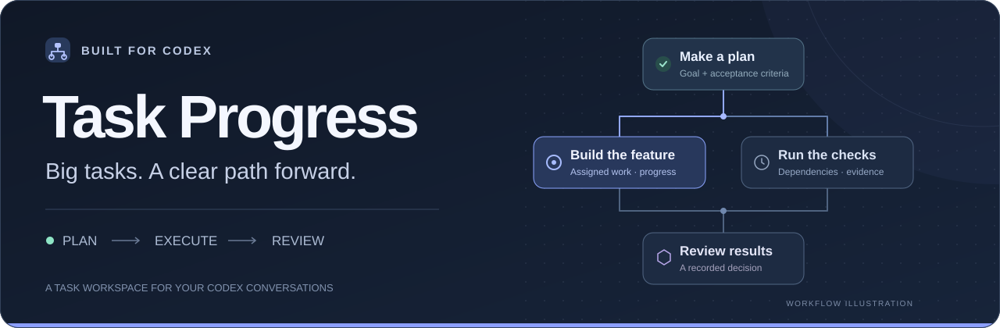
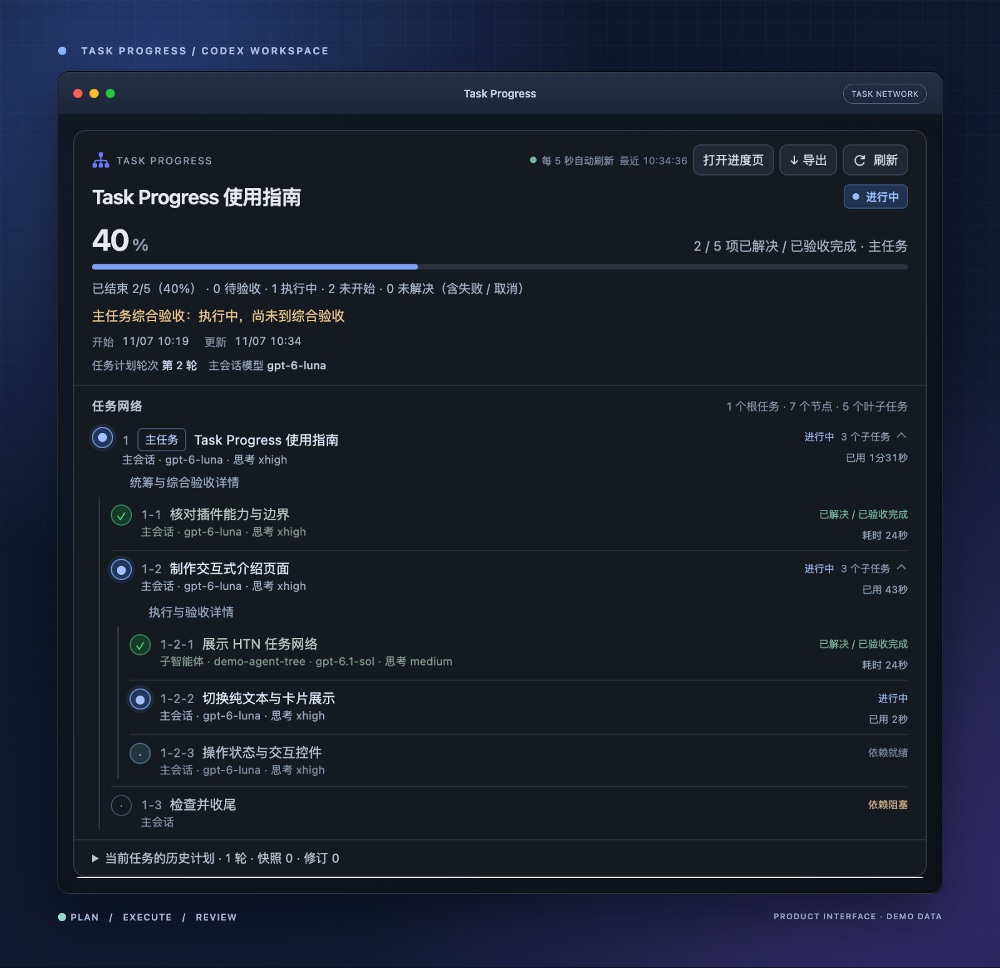

<p align="center">
  
</p>

<p align="center"><strong>任务交给 Codex，进展留在眼前。</strong></p>
<p align="center">把复杂工作展开成一张任务树：谁在做、卡在哪里、结果是否验收，随时看清。</p>

<p align="center">
  <a href="#开始使用"><strong>开始使用 →</strong></a> ·
  <a href="https://carpe-horam.github.io/task-progress-codex/">先看交互演示</a> ·
  <a href="README.en.md">English</a>
</p>

<p align="center"><sub>Codex 插件 · 任务数据本机保存 · Excel / HTML 导出 · MIT 开源</sub></p>

## 让长任务，也有清晰的进展

开发一个功能、排查一个难复现的 bug、让多个 agent 分工协作——任务越复杂，越需要知道下一步。**Task Progress 把计划、执行记录和结果验收放到同一个面板里。**

<p align="center">
  <a href="docs/assets/task-progress-preview-0.2.22.png">
    
  </a>
</p>
<p align="center"><sub>0.2.22 源码界面 · 模拟宿主与演示数据 · 窗口边框为展示设计 · 点击图片放大。</sub></p>

| 你想知道 | 打开面板就能查看 |
| --- | --- |
| **现在做到了哪一步？** | 展开的任务树、当前执行者、状态与耗时。 |
| **为什么还没继续？** | 前置依赖、等待原因，以及尚未解决的工作。 |
| **做完之后，检查过了吗？** | 提交的结果、主会话复核与对应证据，区分执行结束和验收完成。 |

## 开始使用

### 1. 安装插件

需要支持插件与 stdio MCP 的 Codex，以及 Codex 进程 PATH 中可通过 `python` 启动的 **Python 3**。交互面板还需要客户端支持 **MCP Apps**。

```sh
codex plugin marketplace add carpe-horam/task-progress-codex
codex plugin add task-progress@task-progress-codex
```

安装后**重启 Codex**，首次连接会自动安装或更新本机共享后台服务。

<details>
<summary>平台要求与升级说明</summary>

- **macOS**：使用当前登录用户的 LaunchAgent。
- **Linux**：需要可用的 systemd 用户会话。
- **Windows**：使用当前登录用户的任务计划程序。

只有 `python3` 或 `py` 命令时，还需配置可供 Codex 使用的 Python 3 `python` 命令。已有安装请按[安装与升级文档](docs/installation.md)操作；文档也列出了平台前提、服务管理方式与原生验证边界。

</details>

### 2. 给它一个真实任务

把下面这段话复制到 Codex，替换方括号里的内容：

```text
用 Task Progress 帮我完成 [描述你的任务]。
先拆出计划和验收标准，再开始执行；持续更新进度，
有阻塞就说明原因，完成后检查结果并保留证据。
```

### 3. 随时打开进度

在 Codex 中说 **“打开任务进度”**。面板会自动刷新；展开任务看详情，完成后用「导出」保存 Excel 和 HTML 报告。

## 从规划到交付

**计划可以变，执行记录可以回看。** 拆分任务、调整依赖、重试失败步骤，或在中途加入新请求，都能保留对应的计划与尝试记录。结果提交后进入复核，让「执行结束」与「验收完成」各有依据。

| 从规划到推进 | 从结果到交付 |
| --- | --- |
| **任务拆解**<br>将复杂目标拆成有依赖的子任务，按层查看进展。 | **结果复核**<br>查看提交、验收结论和证据，找出尚未解决的部分。 |
| **协作可见**<br>记录主会话与子智能体的分工和执行尝试。 | **历史可查**<br>回看计划变化、重试和先前结果。 |
| **接住新请求**<br>让 Codex 将独立请求排队，或在条件允许时并行处理。 | **报告可带走**<br>导出 Excel 与 HTML，留档、复盘或分享。 |

## 下次遇到这些任务，试试这样说

| 场景 | 直接发给 Codex |
| --- | --- |
| **开发功能** | “用 Task Progress 规划这个功能，先确认接口，再实现界面，最后验证完整流程。” |
| **排查问题** | “用 Task Progress 跟踪这个 bug：复现、定位、修复、验证，每步留下证据。” |
| **多智能体协作** | “让子智能体分别检查代码与文档，用 Task Progress 记录分工，由主会话复核结果。” |
| **临时插入工作** | “把整理使用文档加入队列，当前任务完成后再做。” |
| **交付与复盘** | “检查是否还有未解决任务，汇总验收结果，然后打开进度面板供我导出报告。” |

## 它如何与你的 Codex 配合

Codex 负责规划、执行和协调；Task Progress 负责保存与展示任务状态、依赖和证据。任务数据保存在本机，多个会话各自保留进度。

<details>
<summary><strong>使用前，了解这三个约定</strong></summary>

- **状态来自实际记录。** 面板随 Codex 写入的进展更新；插件不会自行唤醒或控制宿主 agent，也不会自动执行待办任务。
- **提交后还要复核。** 「待主会话验收」表示执行者已提交结果，需要主会话检查；任务执行结束不代表全部问题已解决。
- **展示取决于宿主支持。** 交互面板需要 MCP Apps；首次规划后可请求展示，实际窗口形态由客户端决定。

需要了解验收契约、执行尝试与协作边界，请阅读[执行与职责协议](docs/responsibility-protocol.md)。

</details>

## 继续探索

[交互演示与手册](https://carpe-horam.github.io/task-progress-codex/) · [安装与服务管理](docs/installation.md) · [更新记录](CHANGELOG.md) · [发布版本](https://github.com/carpe-horam/task-progress-codex/releases) · [测试说明](tests/README.md)

用得顺手，欢迎 **Star 收藏**，下次复杂任务直接用起来。也欢迎带着真实场景[反馈问题或建议](https://github.com/carpe-horam/task-progress-codex/issues)。

[MIT License](LICENSE)
